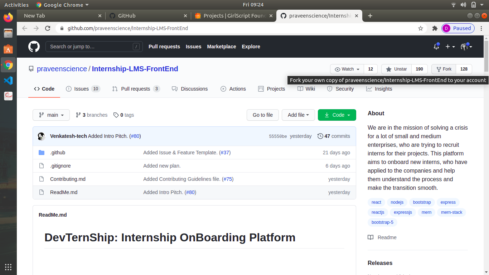

# Contribution Guidelines

1. You need to be **already registered** for **GSSoC ’21** as a participant to contribute.
2. Registrations are **closed** now. We will try to see if we can bring in new people, but it depends on GSSoC Core Team.
3. Participants / contributors have to **comment** on issues they would like to work on, and mentors or the PA will assign you.
4. Issues will be assigned on a **first-come, first-serve basis.**
5. Participants / contributors can also **open their issues**, but it needs to be verified and labelled by a mentor.
6. Each participant / contributor will be **assigned 2 issues (max)** at a time to work.
7. Participants are expected to follow **project guidelines** and [**coding style**](https://blog.praveen.science/git-standards-followed-in-our-way-of-spotify-agile-methodolgy/). **Structured code** is one of our top priority.
8. Try to **explain your approach** to solve any issue in the comments. This will increase the chances of you being assigned.
9. Don't create issues that are **already listed**.
10. Please don't pick up an issue already assigned to someone else. Work on the issues after it gets **assigned to you**.
11. Make sure you **discuss issues** in Discord Server before working on the issue.
12. Pull requests will be merged after being **reviewed** by a mentor.
13. It might take **a day or two** to review your pull request. Please have patience and be nice.
14. Always create a pull request from a **branch** other than `main`.
15. Participants / contributors have to complete issues before the decided Deadline. After that issues will be assigned to others.
16. Deadline for issues:
    - Level0: 1 Day
    - Level1: 2 Days
    - Level2: 3 Days
    - Level3: 5 Days  
      If you fail to make a PR within the deadline, then the issue will be assigned to another person in the queue.
17. While making PRs, don't forget to **add a description** and **screenshots** of your work.
18. Make sure your solution to any issue is better in terms of performance and other parameters in comparison to the previous work.
19. We all are here to learn. You are allowed to make mistakes. That's how you learn, right!.

**Pull Requests Review Criteria**

- Please fill the **PR Template** properly while making a Pull Request.
- You must add your code file into the respective **folders**.
- Your work must be original, written by you not copied from other resources.
- You must comment on your code where necessary.
- For frontend changes kindly share screenshots and work samples of your work before sending a PR.
- Follow the proper [style guides](https://google.github.io/styleguide/) for your work.
- For any queries or discussions, please drop a message in our GSSoC'21 Discord server.

## Contribution Guidelines

To start contributing, follow steps mentioned below:

**1.** Fork [this](https://github.com/praveenscience/Internship-LMS-FrontEnd) repository.
 
<br />


**2.** You'll either find a way to fork to your own account or you will have a link to go to your forked repository. Clicking on either takes you to the forked repository.
<br />


**3.** You can confirm that this repository is a fork of the original repository by finding the "forked from [praveenscience/Internship-LMS-FrontEnd](https://github.com/praveenscience/Internship-LMS-FrontEnd)" text under the repository name.
<br />


**4.** Click on Clone or download button on the forked repository. Make sure you are cloning your version (GitHub.com/\<your username>/Internship-LMS-FrontEnd) and not the CatsInTech organisation's.
<br />


**5.** Clone your forked copy of the project.

```
git clone https://<your_user_name>@github.com/<your_user_name>/Internship-LMS-FrontEnd.git
```

<br />


**6.** Navigate to the project directory. :file_folder:

```
cd Internship-LMS-FrontEnd
```

<br />


**7.** Add a reference (remote) to the original repository.

```
git remote add upstream https://github.com/praveenscience/Internship-LMS-FrontEnd
```

<br />


**8.** Check the remotes for this repository.

```
git remote -v
```

<br />


**9.** Always take a pull from the upstream repository to your master branch to keep it at par with the main project(updated repository).

```
git pull upstream main
```

<br />


**10.** Create a new branch.

```
git checkout -b <your_branch_name>
```

<br />


**11.** Perfom your desired changes to the code base.  
**12.** Track your changes. :heavy_check_mark:

```
git add .
```

<br />


**13.** Commit your changes.

```
git commit -m "Relevant message"
```

<br />


**14.** Push the committed changes in your feature branch to your remote repo.

```
git push -u origin <your_branch_name>
```

<br />


**15.** To create a pull request, click on `compare and pull requests`.  
<br />


**16.** Add appropriate title and description to your pull request explaining your changes and efforts done.  
<br />


**17.** Click on `Create Pull Request`.
<br />


As always, if you have any questions regarding Git, please do reach out on Discord.
